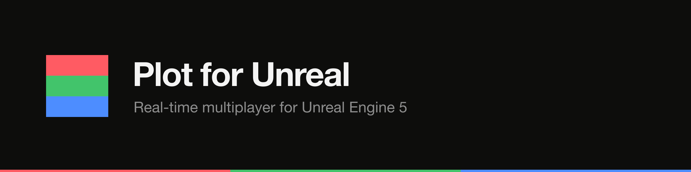

<p align="center"><a href="https://plot.ws"></a></p>

<p align="center">
  <a href="./LICENSE"></a>
  <a href="https://docs.plot.ws/sdks/unreal"></a>
  <a href="https://discord.gg/plot"></a>
  
  
</p>

# Plot Unreal Engine SDK

`PlotClient` — multiplayer SDK for Unreal Engine 5.

This is the BASELINE client: connect / join / send / receive (messages +
presence). Interpolation (v1f) and client-side prediction (v1g) are **not**
ported to Unreal — use the Unity / Godot / Defold SDKs if you need those.

## Install

Copy the plugin into your project (or add it as a git submodule) at
`<YourProject>/Plugins/PlotClient/`, then enable it:

- It is enabled automatically once present (the `.uplugin` declares the
  `PlotClient` Runtime module).
- The plugin depends on the engine's built-in **WebSockets** plugin; UBT pulls
  it in via `PlotClient.Build.cs`.

Regenerate project files (right-click the `.uproject` → *Generate Visual Studio
project files*, or run `GenerateProjectFiles`) and build.

## Quickstart (C++)

The entry point is a `UGameInstanceSubsystem`, so it lives for the lifetime of
the game instance and is reachable from anywhere:

```cpp
#include "PlotClient.h"

UPlotClient* Plot = GetGameInstance()->GetSubsystem<UPlotClient>();

FPlotOptions Options;
Options.AppKey = TEXT("pl_pub_live_xxx");
Options.PlayerId = FGuid::NewGuid().ToString();
Plot->Configure(Options);

FPlotJoinResult OnJoined;
OnJoined.BindLambda([](bool bOk, UPlotRoom* Room, const FString& Error)
{
    if (!bOk)
    {
        UE_LOG(LogTemp, Warning, TEXT("join failed: %s"), *Error);
        return;
    }

    Room->OnMessage.AddDynamic(this, &AMyActor::HandleMessage);
    Room->OnPlayerJoined.AddDynamic(this, &AMyActor::HandlePlayerJoined);
    Room->OnPlayerLeft.AddDynamic(this, &AMyActor::HandlePlayerLeft);

    // `data` is JSON-encoded text; embedded verbatim as the envelope `data`.
    Room->Send(TEXT("{\"hello\":\"world\"}"));
});

Plot->Join(TEXT("LOBBY1"), OnJoined);
```

The event handlers match the multicast delegate signatures:

```cpp
UFUNCTION()
void AMyActor::HandleMessage(const FString& From, const FString& Channel, const FString& DataJson);

UFUNCTION()
void AMyActor::HandlePlayerJoined(const FString& PlayerId, const TArray<FString>& Players);

UFUNCTION()
void AMyActor::HandlePlayerLeft(const FString& PlayerId, const TArray<FString>& Players);
```

## Quickstart (Blueprint)

Everything is Blueprint-exposed:

1. **Get Game Instance Subsystem** → class `Plot Client`.
2. **Configure** — fill an `FPlotOptions` (App Key, Player Id).
3. **Join** — pass a Room Code and bind the `On Result` event. It fires with a
   `Plot Room` on success.
4. On the returned room, **Bind Event to On Message / On Player Joined / On
   Player Left**, then call **Send** with a JSON string to broadcast.

`On Message` gives you `From`, `Channel`, and `Data Json` (the raw JSON of the
`data` payload). Parse `Data Json` into a struct with the engine's JSON
utilities, or keep it as a string.

## Protocol

This SDK speaks `X-Plot-Protocol: v1b.0` — sent both as the REST `/v1/connect`
header and as the WebSocket upgrade header. Wire-format types live in
`Source/PlotClient/Public/Protocol/PlotProtocol.h` as `USTRUCT(BlueprintType)`
structs; **do not hand-edit** — they are generated from
`packages/protocol/codegen/` (target `outputs/unreal/PlotProtocol.h`) and the
file in this plugin is a committed copy of that output. Regenerate with:

```bash
pnpm --filter @plot/protocol codegen
```

The codegen drift check (`pnpm --filter @plot/protocol codegen:check`) keeps the
generated output deterministic.

## CI

`.github/workflows/unreal-ci.yml` runs lightweight structural checks on a stock
Ubuntu runner: it validates the `.uplugin` JSON, confirms the expected Source
files and the generated header are present, and verifies the committed header
matches the codegen output. **A full UE5 compile requires a licensed Unreal
Engine and is out of CI scope** — there is no public, license-free way to run
UnrealBuildTool / UnrealHeaderTool in CI here, so the C++ is verified by hand
against the engine API plus the structural checks above.
